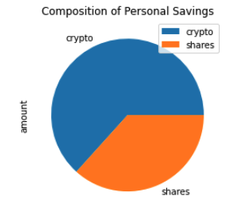
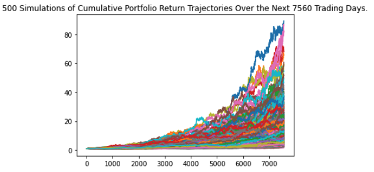

# Unit 5 - Financial Planning

## Consultation Background

My FinTech consultancy firm won our first contract to help one of the biggest credit unions in our local area. They want to create a tool that helps their members enhance their financial health. Working with the Chief Technology Officer (CTO) of the credit union, we will develop a prototype application to demo in the next credit union assembly.

The application will allow the union's members to assess their monthly personal finances, and also be able to forecast a reasonably good retirement plan based on cryptocurrencies, stocks, and bonds.

We have developed a personal finance planner that will allow users to visualize their savings composed by investments in shares and cryptocurrencies to assess if they have enough money as an emergency fund.

Then, they can take this information and utilize a retirement planning tool and run Monte Carlo simulations to project the portfolio performance at 30 years, and a more aggessive timeframe of 10 years and 5 years, given an initial investment amount.

## Resources
The **Financial Planning** development will utilize two APIs:

* The **Alpaca Markets API** will be used to pull historical stocks and bonds information.  
    
* The **Alternative Free Crypto API** will be used to retrieve Crypto asset prices.

The documentation for these APIs can be found via the following links:

* [Free Crypto API Documentation](https://alternative.me/crypto/api/)
* [AlpacaDOCS](https://alpaca.markets/docs/)

